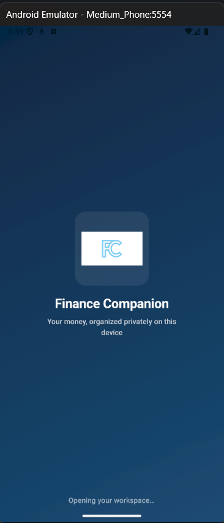
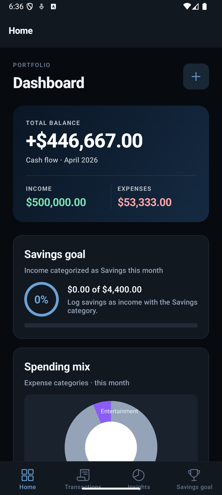
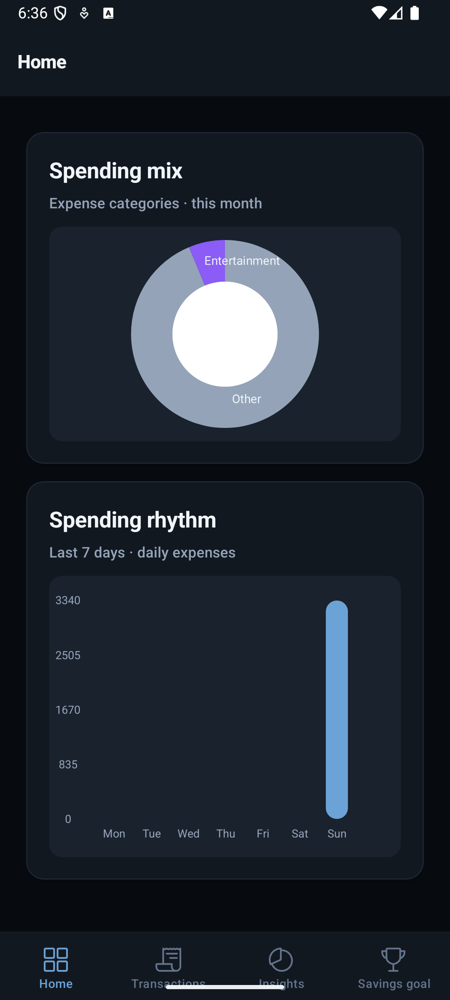
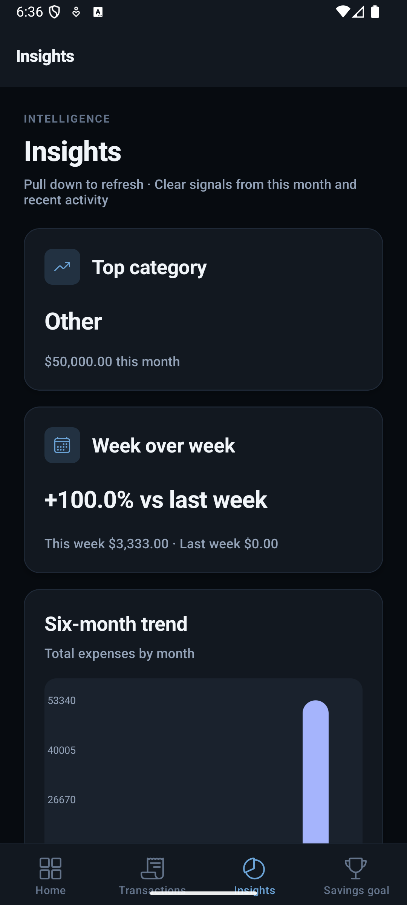
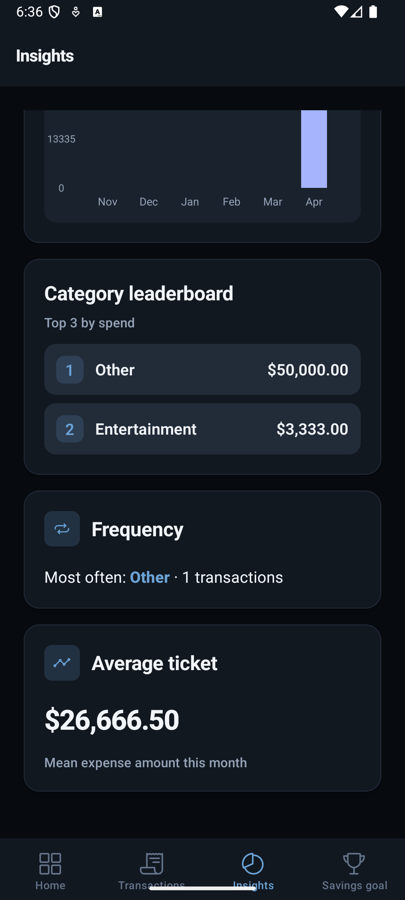
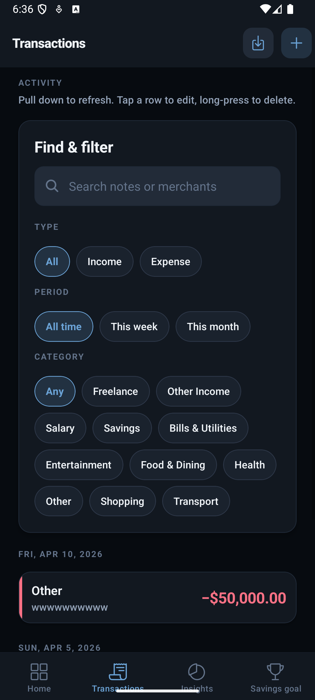
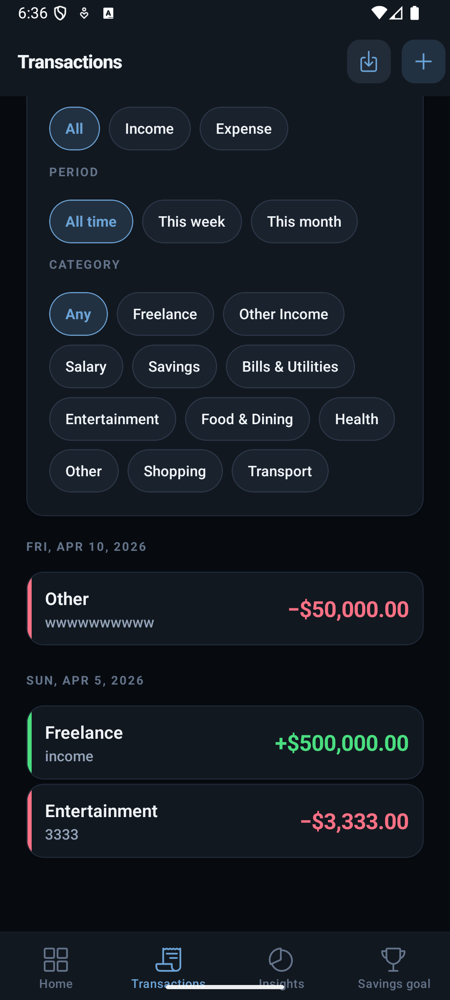
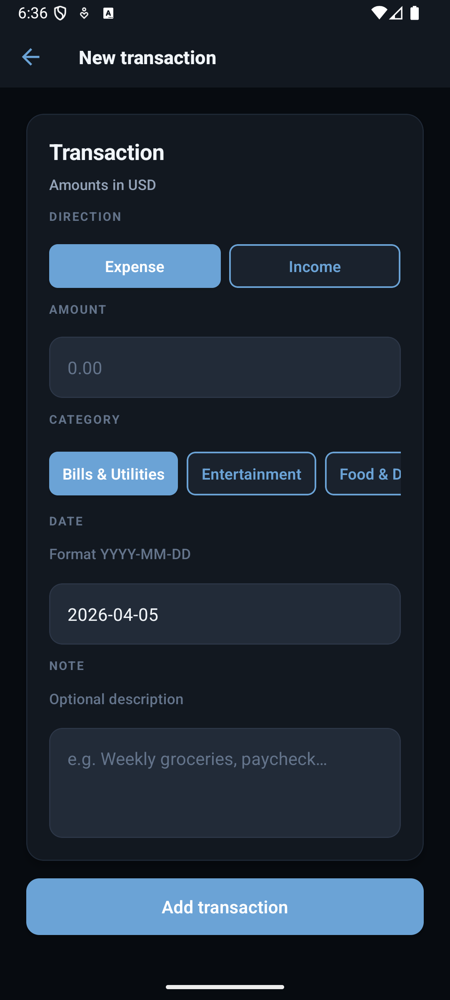
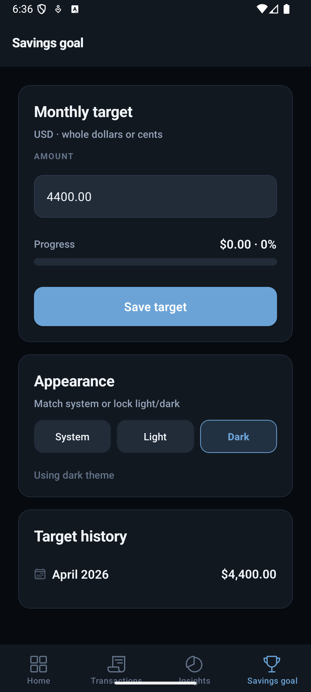

# Personal Finance Companion

Cross-platform **React Native (Expo)** app that helps you track transactions, visualize spending patterns, set a **monthly savings goal**, and explore **financial insights** — with **offline-first** storage using SQLite.

---

## 🚀 Features

- 📊 Dashboard with balance, income, expenses, and charts  
- 💳 Add, edit, delete transactions  
- 🔍 Advanced filtering (type, category, period, search)  
- 🎯 Monthly savings goal tracking  
- 📈 Insights (trends, top categories, averages)  
- 🌙 Dark / Light mode support  
- 📤 CSV export  

---

## 📸 Screenshots

### 👉 Splash Screen
<p align="center">
  
</p>

### 🏠 Dashboard
<p align="center">
  
  
</p>

### 📊 Insights
<p align="center">
  
  
</p>

### 💳 Transactions
<p align="center">
  
  
</p>

### ➕ Add Transaction
<p align="center">
  
</p>

### 🔥 Saving Goals
<p align="center">
  
</p>

---

## 🎥 Demo Video

👉 [Watch Demo Video](https://drive.google.com/file/d/1Um1GIkxXuHeJaxH9v6oiuEKfeYfEK6nG/view?usp=sharing)

---

## ⚡ Quick start

```bash
cd personal-finance-companion
npm install
npx expo start
```

---

## 🛠 Tech stack

- Expo SDK 54, TypeScript
- React Navigation
- Zustand
- expo-sqlite
- react-hook-form + zod
- react-native-gifted-charts

---

## 📂 Project layout

```bash
src/
  components/
  context/
  db/
  features/
  navigation/
  repositories/
  services/
  stores/
  theme/
  utils/
```

---

## 📌 Assumptions

- Single currency (USD)
- Amounts stored in cents
- Uses device timezone
- Balance = total income − expenses
- Savings = income categorized as Savings
- No backend (offline-first)

---

## ⚠️ Known Limitations

- No cloud sync (data stored locally only)
- No authentication (single-user system)
- Limited analytics (basic insights only)
- No multi-currency support
- Custom date range UI not implemented
- SQLite support limited on web

---

## 📜 Scripts

```bash
| Command         | Description     |
| --------------- | --------------- |
| npm start       | Expo dev server |
| npm run android | Android         |
| npm run ios     | iOS             |
| npm run web     | Web (limited)   |
```

---

## 📄 License

Private / assessment use
